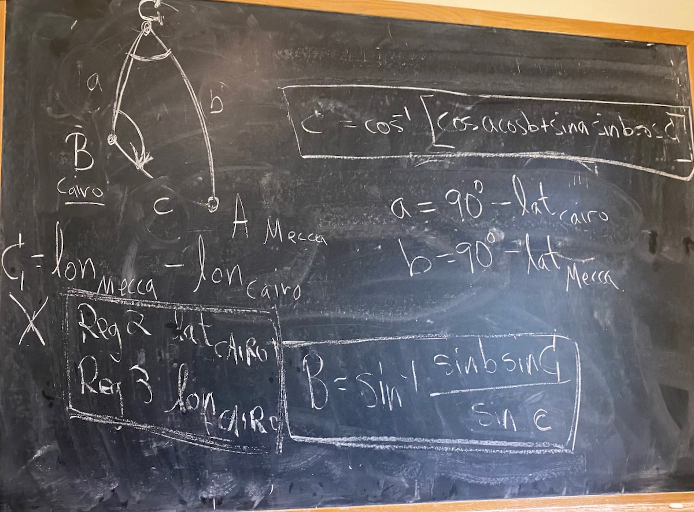

## Numerical Analysis Daily Schedule Term 2

Course [home page](./)

### Week 1

* Tuesday, Aug. 30 &mdash; Prepare for class by following the directions in [Before Calculators](./tex/na_day01.pdf)
* Friday, Sep. 2 &mdash; Prepare for class by following the directions in [Getting Started](./tex/na_day02.pdf) &mdash; You will need to make a copy of [Sections 1-3 of the HP-25 Owner's Handbook](./resources/HP25-OwnersHandbook-Sections1-3.pdf)

### Week 2

* Tuesday, Sep. 6 &mdash; Prepare for class by following the directions in [Calculating with the HP-25](./tex/na_day03.pdf) &mdash; These directions include your first problem set due Sep. 6 &mdash; You will need to make a copy of [Sections 4-5 of the HP-25 Owner's Handbook](./resources/HP25-OwnersHandbook-Sections4-5.pdf)
* Friday, Sep. 9 &mdash; Prepare for class by following the directions in [The Stack, Registers, and Beginning Programming (Including Nimb)](./tex/na_day04.pdf)

### Week 3

* Preparation for Tuesday, Sep. 13 &mdash; Prepare for class by following the directions in [Programming the HP-25](./tex/na_day05.pdf) &mdash; These directions include your second problem set due Sep. 13 &mdash; The directions also include the [HP-25 Program Form](./resources/HP-25ProgramForm.pdf) &mdash; You will probably find the formulas we had on the board last time very helpful in proceeding toward your working program:

!

* Tuesday, Sep. 13 &mdash; Hand out [Solution to Problem Set 1](./assignments/PS01-Solution.pdf)
* Preparation for Friday, Sep. 16 &mdash; Prepare for class by following the directions in [Programming the HP-25 Part II](./tex/na_day06.pdf)
